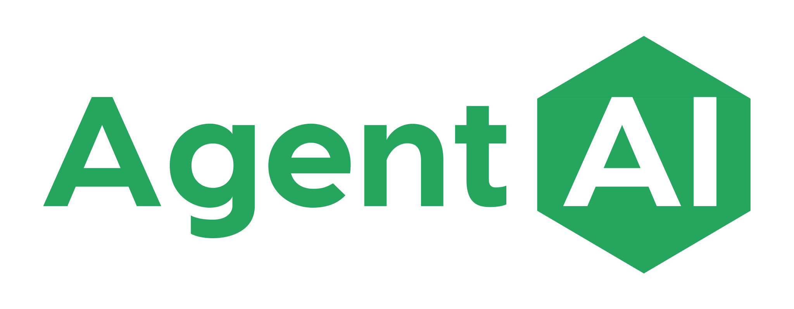

<p align="center">
  <a href="https://agentai.app"></a>
  &nbsp;&nbsp;&nbsp;&nbsp;&times;&nbsp;&nbsp;&nbsp;&nbsp;
  <a href="https://transformcap.com"></a>
</p>

<h1 align="center">AgentAI x Transformation Capital</h1>
<p align="center"><strong>AI-Powered Tools for Deal Intelligence</strong></p>
<p align="center">
  <a href="https://tc-teachin.vercel.app">AI Lunch Slides</a> &bull;
  <a href="https://hotlist.agentai.biz">Hot List Live Demo</a> &bull;
  <a href="#getting-started-in-under-5-minutes">Get Started</a>
</p>

---

A curated [Claude Code](https://docs.anthropic.com/en/docs/claude-code) plugin marketplace purpose-built for investment teams. Each plugin adds specialized capabilities to your Claude terminal — portfolio intelligence, presentation creation, daily briefings, and more.

---

## What's Inside

### 1. Hot List Dashboard

Live portfolio company intelligence — **34 companies**, **$718M total funding**, **1,229 open roles** tracked and enriched automatically.

| Capability | How |
|-----------|-----|
| View the hot list | `/hotlist` |
| Enrich with latest data | `/hotlist enrich` |
| Export to CSV | `/hotlist export` |
| Live dashboard | [hotlist.agentai.biz](https://hotlist.agentai.biz) |

### 2. Claude Code Skills

| Plugin | What You Get | Commands |
|--------|-------------|----------|
| **planner** | Structured planning — brainstorm ideas, evaluate approaches, produce plans | `/plan [topic]` |
| **slides** | Branded HTML presentations from scratch, outline, or PowerPoint | `/new-presentation`, `/slide-check`, `/convert-pptx` |
| **daily-briefing** | Morning summary — calendar, email, Google Chat, draft responses | `/briefing [today/tomorrow/week]` |

### 3. Google Workspace Integration

The **daily-briefing** plugin includes a setup guide that walks you through connecting Gmail, Google Calendar, and Google Chat via a Google Workspace MCP server. Once connected, your briefing pulls email, calendar, and chat data automatically.

---

## Getting Started in Under 5 Minutes

### Step 1 — Install Claude Code

Download from [Anthropic](https://docs.anthropic.com/en/docs/claude-code) and run the installer.

### Step 2 — Install the Marketplace

Open Claude Code and type:

> Install the AgentAI marketplace from https://github.com/SureAgentAI/agentai-tcap-claude-marketplace

Claude will handle the rest. Or use CLI commands:

```
/plugin marketplace add SureAgentAI/agentai-tcap-claude-marketplace
/plugin install slides@agentai-tcap
```

<details>
<summary>Manual configuration (advanced)</summary>

Add the following to your `~/.claude/settings.json`:

```json
{
  "extraKnownMarketplaces": {
    "agentai-tcap": {
      "source": {
        "source": "github",
        "repo": "SureAgentAI/agentai-tcap-claude-marketplace"
      }
    }
  },
  "enabledPlugins": {
    "hotlist@agentai-tcap": true,
    "slides@agentai-tcap": true,
    "planner@agentai-tcap": true,
    "daily-briefing@agentai-tcap": true,
  }
}
```

</details>

### Step 3 — Connect Google & Run Your First Briefing

```
/briefing
```

Claude walks you through Google OAuth on first use. After that, your daily briefing pulls calendar, email, and priorities automatically.

---

## Plugin Catalog

| Plugin | What You Get | Commands |
|--------|-------------|----------|
| **hotlist** | Portfolio company intelligence dashboard — enrichment, ranking, CSV export | `/hotlist`, `/hotlist enrich`, `/hotlist export` |
| **slides** | Branded HTML presentations from scratch, outline, or PowerPoint | `/new-presentation`, `/slide-check`, `/convert-pptx`, `/export-pdf` |
| **planner** | Structured planning — brainstorm ideas, evaluate approaches, produce plans | `/plan [topic]` |
| **daily-briefing** | Morning summary — calendar, email, Google Chat, draft responses | `/briefing [today/tomorrow/week]` |

---

## Plugin Setup

Most plugins work immediately after install. A few require one-time setup.

<details>
<summary><strong>hotlist</strong> — Portfolio Intelligence Dashboard</summary>

### Requirements

- Access to **hotlist.agentai.biz** (protected by Cloudflare Access)
- Your email address must be whitelisted — contact your admin if you see an access denied page

### How It Works

The hotlist plugin connects to the hosted dashboard at `hotlist.agentai.biz` to pull portfolio company data. When you run `/hotlist enrich`, Claude augments company records with public data sources. Use `/hotlist export` to generate CSV files for further analysis.

### Quick Start

```
/hotlist              # View the current portfolio hot list
/hotlist enrich       # Enrich companies with latest data
/hotlist export       # Export to CSV
```

</details>

<details>
<summary><strong>slides</strong> — Presentation Builder</summary>

### Requirements

None. Works immediately.

### How It Works

Creates branded HTML presentations that render in any browser. You can start from scratch, provide an outline, or convert an existing PowerPoint file.

### Quick Start

```
/new-presentation     # Create a presentation from scratch or outline
/convert-pptx         # Convert a PowerPoint file to branded HTML
/slide-check          # Review and refine an existing presentation
/export-pdf           # Export the presentation to PDF
```

</details>

<details>
<summary><strong>planner</strong> — Structured Planning</summary>

### Requirements

None. Works immediately.

### How It Works

Guides you through a structured planning workflow: brainstorm options, evaluate tradeoffs, then produce an actionable plan with clear next steps.

### Quick Start

```
/plan quarterly portfolio review
/plan due diligence checklist for Series B
/plan team offsite agenda
```

</details>

<details>
<summary><strong>daily-briefing</strong> — Morning Briefing</summary>

### Requirements

- Google Workspace MCP server (setup guide included with the plugin)
- Google Cloud project with OAuth credentials for Gmail, Calendar, and Chat APIs

### How It Works

Aggregates your calendar, email, Google Chat messages, and priorities into a concise daily summary. Highlights meetings, action items, and anything that needs attention. Optionally drafts email responses in your communication style using a style profile.

The plugin includes a step-by-step setup guide that walks you through installing the Google Workspace MCP server and authenticating with Google.

### Quick Start

```
/briefing             # Today's briefing
/briefing tomorrow    # Preview tomorrow
/briefing week        # Weekly overview
```

</details>

---

## Security

- **Cloudflare Access** protects deployed apps (e.g., `hotlist.agentai.biz`) with email-based one-time passwords
- **Whitelisted domains only** — access is restricted to authorized email domains (`@transformcap.com`, `@agentai.app`)
- **No secrets in this repo** — all API keys and credentials are provided by you through environment variables or local configuration
- **Plugin permissions** are controlled through your own `settings.json` — you choose which plugins to enable

---

## Staying Updated

Update the marketplace and all installed plugins:

```
/plugin marketplace update agentai-tcap
/plugin update slides@agentai-tcap
```

Or simply ask Claude:

> Update my plugins

---

## Installing Individual Plugins

You do not need to install everything. Pick what you need:

```
/plugin install planner@agentai-tcap
```

To see what is available:

```
/plugin list agentai-tcap
```

---

## Support

For access issues, plugin questions, or feature requests, contact your AgentAI administrator or open an issue in this repository.
